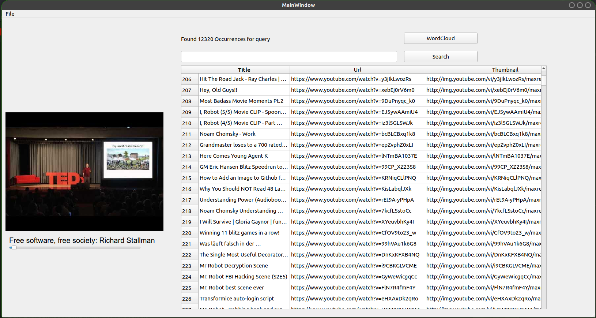

# Scrape your Youtube Profile
**This is still in development.**

It's a youtube history viewer. Essentially a way of organizing information.
I'm writing this application to be able to instantly search my youtube history. Also there may be advanced filters in the future, right now it's just a history viewer. There is a wordcloud feature, which is a nice way to visualize your interests.  
This is all possible thanks to [Google Takeout](https://takeout.google.com/settings/takeout), which enables users to export data from their google accounts. 




# How to run
### Note: I have testet this only on Ubuntu 18.04 with conda as the python environment. 
1. Clone this project

2. Install conda and clone the environment 
```
conda env create --file environment.yml
conda env activate <name-of-environent>

```
3. The command to start the GUI is: 
```
python3.5 extracting_data.py
```
Note that is has to be python3.5


yt_scraping is planned to include the features
- [x] search instantly
- [x] generate pretty Wordclouds
- [x] automatically and concurrently download the thumbnails
- [ ] Display Only Liked Videos
- [ ] advanced text search with filters based on likes, comments, total views, ratio etc
- [ ] approximate string matching [Levenshtein distance](https://en.wikipedia.org/wiki/Levenshtein_distance)
- [ ] full text search (based on the subtitles)
- [ ] read the 10mb html hitory file with a little bit of parallelism/multiprocessing

(these are not the selling points, but rather milestones of the development)


## TODO:
- make code more pythonic (don't need count variables for example)


